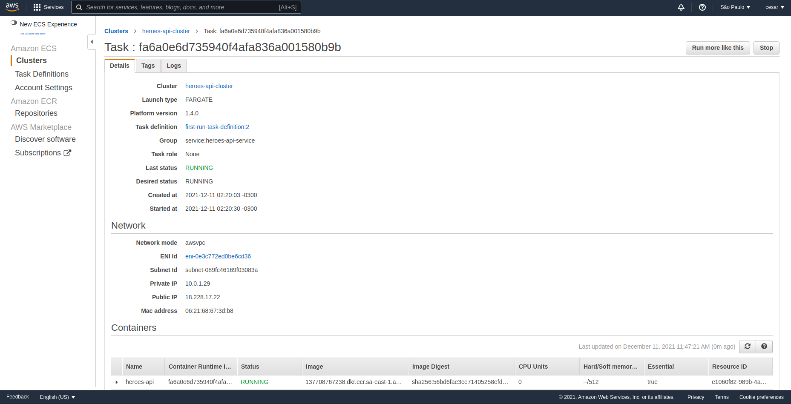
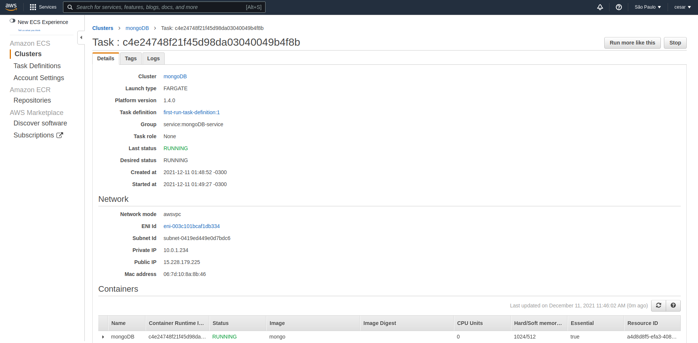

# Heroes-SpringWebflux-api

[Heroes-SpringWebflux-api ](http://18.228.17.22:8080/webjars/swagger-ui/index.html?configUrl=/v3/api-docs/swagger-config#/) on AWS Elastic Container Service 

## Essa API foi desenvolvido utilizando

* Java 8
* Spring Webflux
* Spring Data
* Gradle
* Docker
* MongoDB
* Swagger
* AWS Elastic Container Registry
* AWS Elastic Container Service

## Banco de Dados

#### A integração com o banco de dados foi feita através de um container MongoDB

## AWS

#### Cluster da Aplicação no AWS ECS

#### Cluster do Banco de Dados no AWS ECS

